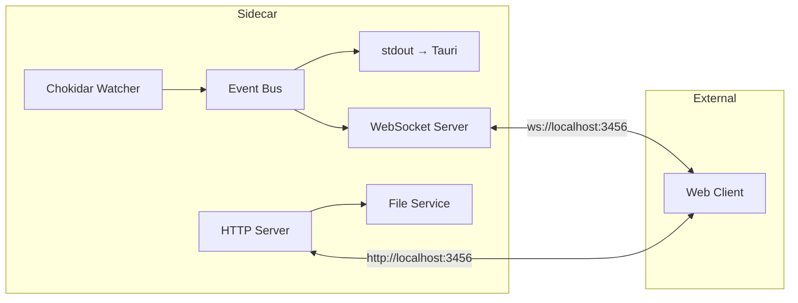

# Folder Watcher API

## 概述

Folder Watcher 提供 WebSocket + HTTP REST API，供外部 Web 程序使用。

| 特性 | 说明 |
|------|------|
| 协议 | WebSocket (实时推送) + HTTP REST (查询/读取) |
| 端口 | `3456` (固定) |
| 安全 | 仅允许读取被监控目录内的文件 |

## 架构



---

## WebSocket API

> [!info] 连接地址
> `ws://localhost:3456`

### 客户端消息

#### subscribe

订阅文件变动事件。

```json
{
  "type": "subscribe",
  "payload": {
    "directoryIds": ["uuid1", "uuid2"]
  }
}
```

| 字段 | 类型 | 必填 | 说明 |
|------|------|------|------|
| `type` | string | 是 | 固定为 `subscribe` |
| `payload.directoryIds` | string[] | 否 | 要订阅的目录 ID 列表，不传则订阅全部 |

#### unsubscribe

取消订阅。

```json
{
  "type": "unsubscribe"
}
```

#### ping

心跳检测。

```json
{
  "type": "ping"
}
```

---

### 服务端消息

#### subscribed

订阅成功响应。

```json
{
  "type": "subscribed",
  "payload": {
    "directories": [
      { "id": "uuid1", "path": "/path/to/dir1" },
      { "id": "uuid2", "path": "/path/to/dir2" }
    ]
  },
  "timestamp": 1705234567890
}
```

#### file_change

文件变动事件。

```json
{
  "type": "file_change",
  "payload": {
    "id": "directory-uuid",
    "eventType": "create",
    "filePath": "/full/path/to/file.txt",
    "timestamp": 1705234567890
  },
  "timestamp": 1705234567890
}
```

| 字段 | 类型 | 说明 |
|------|------|------|
| `payload.id` | string | 所属监控目录的 UUID |
| `payload.eventType` | string | `create` \| `modify` \| `delete` |
| `payload.filePath` | string | 文件的完整路径 |
| `payload.timestamp` | number | 事件发生时间戳 (ms) |

#### directory_added

新增监控目录。

```json
{
  "type": "directory_added",
  "payload": {
    "id": "new-uuid",
    "path": "/path/to/new/dir"
  },
  "timestamp": 1705234567890
}
```

#### directory_removed

移除监控目录。

```json
{
  "type": "directory_removed",
  "payload": {
    "id": "removed-uuid"
  },
  "timestamp": 1705234567890
}
```

#### error

错误消息。

```json
{
  "type": "error",
  "payload": {
    "message": "Error description"
  },
  "timestamp": 1705234567890
}
```

#### pong

心跳响应。

```json
{
  "type": "pong",
  "payload": {},
  "timestamp": 1705234567890
}
```

---

## HTTP REST API

> [!info] 基础地址
> `http://localhost:3456`

### GET /api/health

健康检查。

**响应**

```json
{
  "success": true,
  "data": {
    "status": "ok"
  }
}
```

---

### GET /api/directories

获取所有监控目录列表。

**响应**

```json
{
  "success": true,
  "data": {
    "directories": [
      { "id": "uuid1", "path": "/path/to/dir1" },
      { "id": "uuid2", "path": "/path/to/dir2" }
    ]
  }
}
```

---

### GET /api/files

列出指定监控目录内的所有文件。

> [!note] 说明
> 只返回文件，不包含子目录。子目录会被递归扫描（如果 `recursive=true`）。

**参数**

| 参数 | 类型 | 必填 | 说明 |
|------|------|------|------|
| `directoryId` | string | 是 | 监控目录的 UUID |
| `recursive` | boolean | 否 | 是否递归子目录，默认 `true` |

**请求示例**

```
GET /api/files?directoryId=uuid1
GET /api/files?directoryId=uuid1&recursive=false
```

**成功响应 (200)**

```json
{
  "success": true,
  "data": {
    "directoryId": "uuid1",
    "directoryPath": "/path/to/dir1",
    "files": [
      {
        "path": "/path/to/dir1/file1.txt",
        "relativePath": "file1.txt",
        "size": 1234,
        "mimeType": "text/plain",
        "modifiedAt": 1705234567890
      },
      {
        "path": "/path/to/dir1/subdir/file2.json",
        "relativePath": "subdir/file2.json",
        "size": 567,
        "mimeType": "application/json",
        "modifiedAt": 1705234560000
      }
    ],
    "totalCount": 2
  }
}
```

| 字段 | 类型 | 说明 |
|------|------|------|
| `directoryId` | string | 监控目录 UUID |
| `directoryPath` | string | 监控目录绝对路径 |
| `files` | array | 文件列表 |
| `files[].path` | string | 文件绝对路径 |
| `files[].relativePath` | string | 相对于监控目录的路径 |
| `files[].size` | number | 文件大小 (字节) |
| `files[].mimeType` | string | MIME 类型 |
| `files[].modifiedAt` | number | 最后修改时间戳 (ms) |
| `totalCount` | number | 文件总数 |

**错误响应 (400)**

```json
{
  "success": false,
  "error": "Missing required parameter: directoryId"
}
```

**错误响应 (404)**

```json
{
  "success": false,
  "error": "Directory not found"
}
```

---

### GET /api/file

读取文件内容。

> [!warning] 安全限制
> 只能读取被监控目录内的文件，尝试读取其他路径会返回 403。

**参数**

| 参数 | 类型 | 必填 | 说明 |
|------|------|------|------|
| `path` | string | 是 | 文件的绝对路径 |

**请求示例**

```
GET /api/file?path=/Users/steve/Documents/test.txt
```

**成功响应 (200)**

```json
{
  "success": true,
  "data": {
    "path": "/Users/steve/Documents/test.txt",
    "content": "File content here...",
    "encoding": "utf-8",
    "size": 1234,
    "mimeType": "text/plain"
  }
}
```

| 字段 | 类型 | 说明 |
|------|------|------|
| `path` | string | 文件路径 |
| `content` | string | 文件内容 |
| `encoding` | string | `utf-8` (文本) 或 `base64` (二进制) |
| `size` | number | 文件大小 (字节) |
| `mimeType` | string | MIME 类型 |

**错误响应 (400)**

```json
{
  "success": false,
  "error": "Missing required parameter: path"
}
```

**错误响应 (403)**

```json
{
  "success": false,
  "error": "File path is not within any watched directory"
}
```

---

## 数据类型

### APIResponse

HTTP API 通用响应格式。

```typescript
interface APIResponse<T> {
  success: boolean;
  data?: T;       // 成功时返回
  error?: string; // 失败时返回
}
```

### WatchedDir

```typescript
interface WatchedDir {
  id: string;    // UUID
  path: string;  // 绝对路径
}
```

### WSClientMessage

```typescript
interface WSClientMessage {
  type: 'subscribe' | 'unsubscribe' | 'ping';
  payload?: {
    directoryIds?: string[];
  };
}
```

### WSServerMessage

```typescript
interface WSServerMessage {
  type: 'file_change' | 'directory_added' | 'directory_removed' |
        'error' | 'pong' | 'subscribed';
  payload: Record<string, unknown>;
  timestamp: number;
}
```

### FileContentResponse

```typescript
interface FileContentResponse {
  path: string;
  content: string;
  encoding: 'utf-8' | 'base64';
  size: number;
  mimeType: string;
}
```

### FileInfo

```typescript
interface FileInfo {
  path: string;          // 绝对路径
  relativePath: string;  // 相对于监控目录的路径
  size: number;          // 文件大小 (字节)
  mimeType: string;      // MIME 类型
  modifiedAt: number;    // 最后修改时间戳 (ms)
}
```

### FilesListResponse

```typescript
interface FilesListResponse {
  directoryId: string;
  directoryPath: string;
  files: FileInfo[];
  totalCount: number;
}
```

---

## 安全机制

### 路径验证

> [!important] 核心安全策略
> 所有文件读取请求都会验证路径是否在监控目录内。

验证逻辑：
1. 将请求路径解析为绝对路径 (`path.resolve()`)
2. 遍历所有监控目录，检查文件是否在其中
3. 使用 `path.relative()` 计算相对路径，若以 `..` 开头则拒绝
4. 符号链接会被解析为实际路径后再验证

### 文件大小限制

| 限制 | 值 |
|------|------|
| 最大文件大小 | 10 MB |

### CORS 配置

```
Access-Control-Allow-Origin: *
Access-Control-Allow-Methods: GET, OPTIONS
Access-Control-Allow-Headers: Content-Type
```

---

## 支持的 MIME 类型

### 文本类型 (UTF-8 编码)

| 扩展名 | MIME 类型 |
|--------|-----------|
| `.txt` | `text/plain` |
| `.json` | `application/json` |
| `.js` | `application/javascript` |
| `.ts` | `application/typescript` |
| `.html` | `text/html` |
| `.css` | `text/css` |
| `.md` | `text/markdown` |
| `.xml` | `application/xml` |
| `.yaml` `.yml` | `text/yaml` |

### 二进制类型 (Base64 编码)

| 扩展名 | MIME 类型 |
|--------|-----------|
| `.png` | `image/png` |
| `.jpg` `.jpeg` | `image/jpeg` |
| `.gif` | `image/gif` |
| `.pdf` | `application/pdf` |

---

## 使用示例

### JavaScript WebSocket 客户端

```javascript
const ws = new WebSocket('ws://localhost:3456');

ws.onopen = () => {
  // 订阅所有目录的变动
  ws.send(JSON.stringify({ type: 'subscribe' }));
};

ws.onmessage = (event) => {
  const message = JSON.parse(event.data);

  switch (message.type) {
    case 'subscribed':
      console.log('已订阅目录:', message.payload.directories);
      break;
    case 'file_change':
      console.log('文件变动:', message.payload);
      break;
    case 'error':
      console.error('错误:', message.payload.message);
      break;
  }
};

// 心跳保活
setInterval(() => {
  if (ws.readyState === WebSocket.OPEN) {
    ws.send(JSON.stringify({ type: 'ping' }));
  }
}, 30000);
```

### 列出目录文件

```javascript
async function listFiles(directoryId, recursive = true) {
  const url = `http://localhost:3456/api/files?directoryId=${directoryId}&recursive=${recursive}`;
  const response = await fetch(url);
  const result = await response.json();

  if (result.success) {
    console.log(`目录: ${result.data.directoryPath}`);
    console.log(`文件数: ${result.data.totalCount}`);

    for (const file of result.data.files) {
      console.log(`  ${file.relativePath} (${file.size} bytes)`);
    }

    return result.data.files;
  } else {
    throw new Error(result.error);
  }
}
```

### 读取文件内容

```javascript
async function readFile(filePath) {
  const url = `http://localhost:3456/api/file?path=${encodeURIComponent(filePath)}`;
  const response = await fetch(url);
  const result = await response.json();

  if (result.success) {
    const { content, encoding, mimeType } = result.data;

    if (encoding === 'base64') {
      // 二进制文件，解码 base64
      const binary = atob(content);
      return { binary, mimeType };
    } else {
      // 文本文件
      return { text: content, mimeType };
    }
  } else {
    throw new Error(result.error);
  }
}
```

### 完整工作流示例

```javascript
async function main() {
  // 1. 获取所有监控目录
  const dirsResponse = await fetch('http://localhost:3456/api/directories');
  const { data: { directories } } = await dirsResponse.json();

  // 2. 列出第一个目录的所有文件
  const files = await listFiles(directories[0].id);

  // 3. 读取第一个文件的内容
  if (files.length > 0) {
    const content = await readFile(files[0].path);
    console.log('文件内容:', content);
  }

  // 4. 订阅实时变动
  const ws = new WebSocket('ws://localhost:3456');
  ws.onopen = () => ws.send(JSON.stringify({ type: 'subscribe' }));
  ws.onmessage = (e) => console.log('变动:', JSON.parse(e.data));
}
```

---

## 相关文档

- [[../CLAUDE|项目 CLAUDE.md]]
- [[Architecture|架构设计]] %%TODO: 待创建%%

---

## 更新日志

| 日期 | 变更 |
|------|------|
| 2025-01-14 | 添加 `GET /api/files` 列出目录文件接口 |
| 2025-01-14 | 初始版本 |
